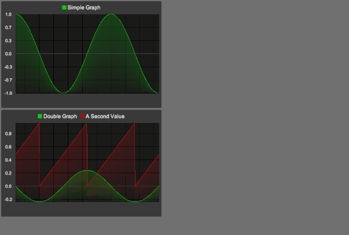

[](http://roytheunissen.com)
[](LICENSE.md)
 

_Allows you to quickly visualize continuously changing values for debugging purposes._

## About the Project

Very often when you're working on something gameplay or animation related it's not just relevant what a variable's exact value is, but what **shape** its curve has.

Is it flat? Smooth? Spiky? I don't know about you but I find it impossible to understand that just by logging the value in the console. I need to see it.

There are two supported workflows in Value-Graphing:

### Global Graphs

When debugging a feature you're working on, you often want to just write one throwaway line of code that graphs a value for you, that you can then immediately remove once you understand the way a value works.

That's what Value Graphing's "Global Graphs" are for! Very easy syntax, automatically drawn. Easy to remove again.

```cs
// Simple graph with just one value
Graph.Get("Simple Graph").AddValue(Mathf.Sin(Time.time * Mathf.PI));

// More advanced graph with two related values, for easy comparison
Graph.Get("Double Graph").AddValue(Mathf.Cos(Time.time * Mathf.PI) * 0.25f)
    .AddValue(Time.time.Repeat(1.0f), "A Second Value");
```


### Local Graphs

If you have some data of which you'd like to see the shape / trends of at any given time via a debug menu, you can also embed a `Graph` prefab into your canvas and send values to that. That's the best way to create graphs that are meant to stick around during development, because it gives you more control over the size / layout and it integrates nicely with other UI.

## Getting Started

- Add Value Graphing to your Unity project (tips on how to install it are in the Installation section)
- Does your project use URP? Define a scripting define symbol called `URP` in `Project Settings > Player` like so: 

- Call `Graph.Get("Name Of Your Value").AddValue(yourValue)`

***TIP**: If you want to prevent adding a using directive so you can remove it easier, try the fully qualified name instead:*
`RoyTheunissen.Graphing.Graph.Get("Name Of Your Value").AddValue(yourValue)`

## Other features

The syntax is optimized for fluid, one-line creation of simple graphs. However, it also supports explicitly creating and destroying graphs and lines.

You can use `graph.GetLine` to get more advanced types of lines, such as vertical lines or horizontal lines.

#### Horizontal Lines (Thresholds)


You can add a horizontal line for testing if a value meets a certain threshold. The syntax for that is as follows:

```cs
Graph.Get("Value To Compare").AddValue(Mathf.Sin(Time.time * Mathf.PI))
        .GetLine("Threshold", Color.red, GraphLine.Modes.Threshold).SetThreshold(0.75f);
```

#### Vertical Lines (Moments)


You can also add a vertical line for testing when a specific condition is satisfied. The syntax for that is as follows:

```cs
Graph.Get("Value To Compare").AddValue(jumpValue)
        .GetLine("SPACE key press", Color.red, GraphLine.Modes.VerticalLines).AddValue(Input.GetKeyDown(KeyCode.Space));
```

## Compatibility

It is made for Unity 2021 and BRP, but has been tested to work with Unity 2022 and URP.

If you want my help in supporting an even earlier version, feel free to reach out.

## Installation

### Package Manager

Go to `Edit > Project Settings > Package Manager`. Under 'Scoped Registries' make sure there is an OpenUPM entry.

If you don't have one: click the `+` button and enter the following values:

- Name: `OpenUPM` <br />
- URL: `https://package.openupm.com` <br />

Then under 'Scope(s)' press the `+` button and add `com.roytheunissen`.

It should look something like this: <br />


<br />
All of my packages will now be available to you in the Package Manager in the 'My Registries' section and can be installed from there.
<br />


### Git Submodule

You can check out this repository as a submodule into your project's Assets folder. This is recommended if you intend to contribute to the repository yourself.

### OpenUPM
The package is available on the [openupm registry](https://openupm.com). It's recommended to install it via [openupm-cli](https://github.com/openupm/openupm-cli).

```
openupm add com.roytheunissen.value-graphing
```

### Manifest
You can also install via git URL by adding this entry in your **manifest.json**
```
"com.roytheunissen.value-graphing": "https://github.com/RoyTheunissen/Value-Graphing"
```

### Unity Package Manager
From Window->Package Manager, click on the + sign and Add from git
```
https://github.com/RoyTheunissen/Value-Graphing.git
```


## Contact
[Roy Theunissen](https://roytheunissen.com)

[roy.theunissen@live.nl](mailto:roy.theunissen@live.nl)
